# Local Voltage Control
### OpenECA Analytic Design Document

|     |
| --- |
| **Duotong Yang** |
| **Zhijie Nie** |
| **2016-10-31** |

**1. Statement of Work**
=====================

Dominion currently uses SCADA data as inputs to centrally drive control algorithms for managing the LTCs and capacitor/reactor banks at certain individual substations. We propose a methodology that includes LTC signals and breaker statuses for capacitor/reactor banks in the synchrophasor streams to drive a control application which duplicates such control systems in the openECA environment attributed to synchrophasor data instead of SCADA data. For the Alpha version, the system is considered to be hybrid, which means the input measurements include synchrophasors and EMS data. The original controller’s source code is written in Perl. Apart from translating the original source code to C\#, several improvements to the program are developed:

-   More comprehensive modeling for local voltage controller (LVC)

-   Modified data flow which is different from the original controller program

-   More generic xml-based configuration

-   Co-simulation based on C\#, python, and PSSE

**2. Introduction to Local Voltage Controller**
============================================

The analytic is utilizing existing controllers from the Dominion EMS – simple controllers that use signals of voltage, real and reactive power to control transformer taps, and to coordinate with other voltage controlling devices such as capacitors, reactors and SVCs.

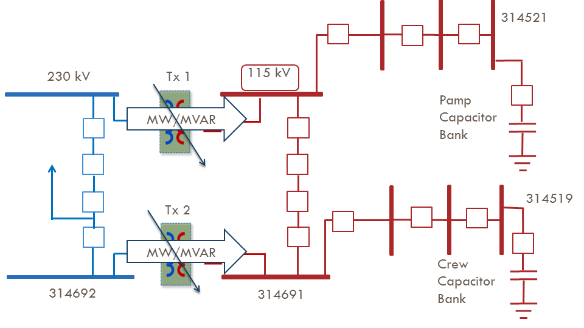

> Figure 1 Farm Substation Voltage Controller

The Alpha version analytics selects one of the substation controller among all 43 existing SCADA-EMS based schemes across the transmission network in Dominion Virginia Power. Farm substation local voltage controller is selected as the target controller since it has both Capacitor Bank and LTC control schemes. With PMU installed at the 115 kV bus, Farm substation is capable of implementing controls driven by synhcrophasor measurement. Figure 1 shows the diagram of Farm substation voltage controller. The voltage at bus 314691 and voltages at Pamp 115 kV substation and Crew 115 kV substation are selected as input signals. Besides, the reactive power flow inside transformers in Farm substation and reactive power output from Clov generator are also included as input signal. The breaker at 230 kV line is assumed to be online. As shown in reference and original program, the main logic of control program is shown as follows:

> Table 1 Check if transformer is in service:

| Parameters | Description                   | Status                                |
|------------|-------------------------------|---------------------------------------|
| LocRemV    | Local remote                  | Remote                                |
| ScadaSwV   | Scada switch                  | On                                    |
| HighSideV  | Transformer high side breaker | Close                                 |
| LowSideV   | Transformer low side breaker  | Close                                 |
| VoltsV     | Transformer low side voltage  | Larger than 101.2 or lower than 128.8 |
| Mwv        | Real power in transformer     | Larger than 0.5 MW                    |
| MvrV       | Reactive power in transformer | Larger than 0.5 MVAR                  |
| TapV       | Tap position                  | Larger than -16 and lower than 16     |

> Table 2 Check if capbank is in service:

| Parameters | Description            | Status                                |
|------------|------------------------|---------------------------------------|
| OpCapV     | Capbank status         | On                                    |
| ScadaSwV   | Scada switch           | On                                    |
| MiscV      | Capbank lock out alarm | On and Not Alarm                      |
| BusBkrV    | Bus breaker            | Close                                 |
| CapBkrV    | CapBank breaker        | Not Null                              |
| LockvV     | Capbank voltage        | Larger than 101.2 or lower than 128.8 |

There are delay settings for both capacitor bank and LTC. Two capacitor banks are not allowed to operate within 30 runs of each other. Also, each capacitor bank is not allowed to operate either within 3 runs of LTC or 3 runs of consecutive delays. LTC is not allowed to operate within 3 runs of consecutive delays.

> Table 3 Delays of Control:

| Parameters | Description                   | Original limit (runs) | New limit (runs) |
|------------|-------------------------------|-----------------------|------------------|
| Ncdel      | Delay count for capbank       | 30                    | 5                |
| Ntdel      | Delay count for LTC           | 3                     | 3                |
| ConsecCap  | Consecutive delay for capbank | 3                     | 3                |
| ConsecTap  | Consecutive delay for LTC     | 3                     | 3                |

> Table 4 LTC control logic:

| LTC Index | Raise parameter | Lower parameter |
| --- | --- | --- |
| Transformer 1 | 115 kV bus voltage <= 114 kV If reactive power difference between two transformers > 9.0 MVAR and Transformer 1 reactive power is the lowest  | 115 kV bus voltage > 114 kV If reactive power difference between two transformers &gt; 9.0 MVAR and Transformer 1 reactive power is the highest  |
| Transformer 2 | 115 kV bus voltage <= 114 kV If reactive power difference between two transformers > 9.0 MVAR and Transformer 2 reactive power is the lowest  | 115 kV bus voltage > 114 kV If reactive power difference between two transformers &gt; 9.0 MVAR and Transformer 1 reactive power is the highest |

> Table 5 Capbank control logic:

| CapBanks | Close parameter | Trip parameter |
| :---: | :---: | :---: |
| Pamp | Pamp voltage <= 113.5 kV   **or**   Clov reactive power output > 120 MVAR | Pamp voltage >= 119.7 kV   **or**   Clov reactive power output < -12.0 MVAR  |
| Crew     | Crew voltage &lt;= 113.5 kV   **or**   Clov reactive power output > 120 MVAR | Crew voltage >= 119.7 kV   **or**   Clov reactive power output &lt; -12.0 MVAR  |

**3. Program Details**
==================

*Data Structure*
---

The data structure of the Alpha version controller is shown as follows:

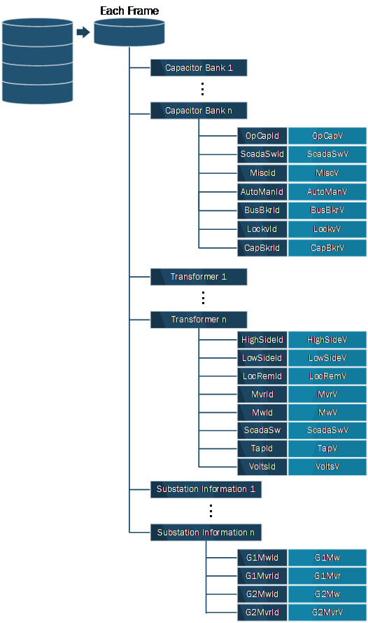
> Figure 2 Data Structure

*Data Flow*
---

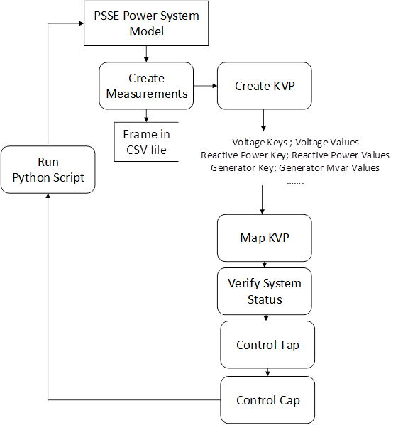
> Figure 3 Data Flow

*Program*
---------

**C# code**

a.  csvAdapter

> Read measurements from csv file

b.  ReadInputAdapter

> Read measurements from csv files and create key value pairs (KVP)

c.  VoltVarControllerAdapter

> Main adapter; Create control signals

**Python code**

d.  DVPScaleLoad\_CreateBenchMarkModel.py

> Create bench mark PSSE model

e.  CleanData.py

1.  Delete the old data

2.  Create a new PSSE \*.sav file

f.  DVPScaleLoad.py

<!-- -->

1.  Read commands from main adapter

    In this section, the Python Scripts read the control variables from the main adapter in C\#, and load the PSSE \*.sav case.

2.  Control PSSE model

    In this section, in the first place, the Python Scripts determine the ratio and power flow of transformers. According to the previous configurations of the transformers, the program subsequently determines which transformer should be controlled and the corresponding control methods, then records the new configurations in **Transformer.csv**. Then, invoke the power flow calculation in PSSE with modified parameters and settings of all controllable devices. Abort if the power flow calculation shows the system collapses, then return to previous configurations.

3.  Save measurements

    After the result from PSSE power flow calculation is recorded, the measurements are transferred to a series of \*.csv files for proper bookkeeping. Regarding to the data of transformers, tap positions, real power flow, reactive power flow, voltage measurements, and other modified parameters as well are updated and logged respectively in the different columns in **Transformer.csv**. As for the data of capacitor banks, the modified parameters and settings, and other configurations as well are updated and logged in **CapBank.csv**. In addition, the delay information is updated and logged in **SubInformation.csv**, the power flow differences are updated and logged in **pfDifference.csv**.

**4. Test**
========

The demonstration is conducted across two platforms: PSSE and C\# as shown in Figure 2. The PSSE model is simulating the power system that provides measurements as input signals for the voltage controller written in C\#. When the logic is triggered inside the voltage controller, the control signal will be sent back to PSSE and execute the control decision.

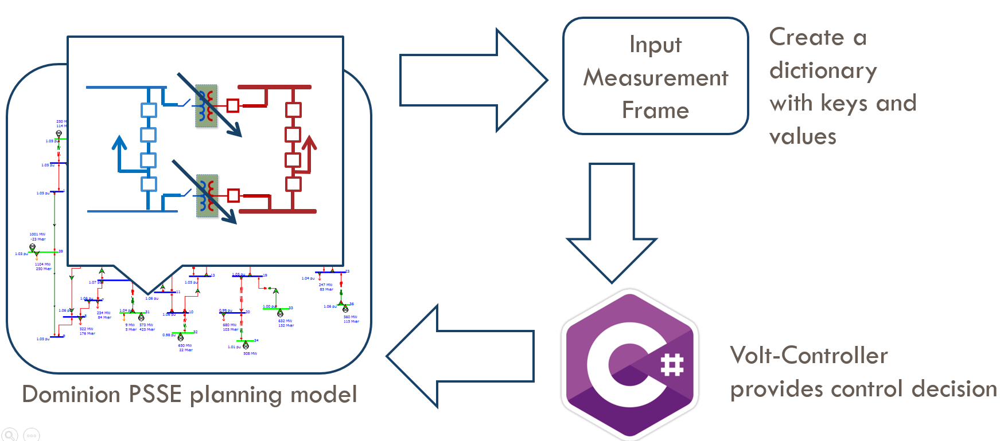
-------------------------------------------------------

> Figure 4 Cross-Validation

**Note:**

1.  The python programs can be used for both PSSE 33 and PSSE 34

2.  To test a specific case, please navigate to the test folder, e.g., Test1

3.  Change the path of data folder, logs folder, and python in C\#:  
Navigate to the adapter: VoltVarControllerAdapter, then change the path in Main:  

4.  Click start, then you are supposed to see the program is continuously generating xml files in the data folder and logs folder. The program is designed to run 30 time instance only, so there will be 30 xml files generated in total.

5.  To check the voltage measurements, please open the csv files. For example, the voltage measurement for 115 kV bus in Farm substation is stored in the 19th column of the transformer\#.csv with name tag VoltsV. The voltage measurement for Crew and Pamp substations are stored in the 22nd column of Capbank\#.csv file with label LockvV.

4.1  *Test 1: Transformer Tap Changing*
---

In this section, the simulation is conducted to demonstrate the control logic for the load tap changers. The tap position for both transformers are initialized as 0 while the tap limit position is ±16. The low and high voltage limits of both transformers is set to 114 kV and 116 kV respectively.

*Scenario A: Both Transformers’ Voltages Reach Lower Limits*
------------------------------------------------------------

1.  Run **DVPScaleLoad\_CreateBenchMarkModel.py**  
The script will scale up the load at buses: 314691, 314692, 314693, 314694, 314695 for 350% and thus create a benchmark model with voltage at bus 314691 less than 115 kV.

2.  Set “**TapV**” for both transformers in configuration and csv files into 0

    If the tap positions are initialized as 0, both transformers are unable to reach the highest tap position settings, which is 16. As load increasing continuously, the voltage controller is capable to regulate to a preferable voltage magnitude with tap changers’ operations from both transformers.

3.  Navigate to the directory of C\# scripts of Voltage Controller, run the solution file **VoltController4.sln** under the Microsoft Visual Studio environment.

    It generates a series of operation condition frames according to different load settings during the voltage control stage.

**Comment:** From the results in **transformer1.csv**, plot the voltage magnitudes and the values for tap changer for this transformer. Fig.1 indicates the changes of voltage magnitude and tap position. As the load demand kept rising, the figure has shown two times of touches of the lower limit 114 kV at time instances 6 and 21, each of which has triggered tap changing in both transformers due to the sufficient spare amount to the highest tap position.

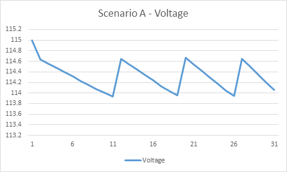
> Figure 5 (a) Scenario A: Both Transformers’ Voltages Reach Lower Limits

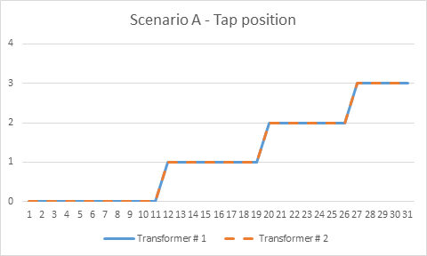
> Figure 5 (b) Scenario A: Both Transformers’ Voltages Reach Lower Limits

*Scenario B: One Transformer’s Tap Reaches the Limit*
-----------------------------------------------------

1.  Set “**TapV**” for transformers in configuration and csv files into 14 and 15

    The second transformer is able to reach the highest tap position 16 first, then regulate to a preferable voltage magnitude coordinated by both transformers’ tap changers.

2.  Navigate to the directory of C\# scripts of Voltage Controller, run the solution file **VoltController4.sln** under the Microsoft Visual Studio environment. It generates a series of operation condition frames according to different load settings during the voltage control stage.

**Comment:** From the results in **transformer2.csv**, plot the voltage magnitudes and the values for tap changer for this transformer. Fig.2 indicates the changes of voltage magnitude and tap position. As the load demand kept rising, the figure has shown two times of touches of the lower limit 114 kV at time instances 6 and 21, and the second transformer changed its tap position at the time instance 6. However, at the time instance 25, even if the voltage has dropped below the lower limit, due to insufficient tap changing at this time, the voltage continued to drop, which reveals the unavailability of tap changings to maintain the voltage level at a preferable range.

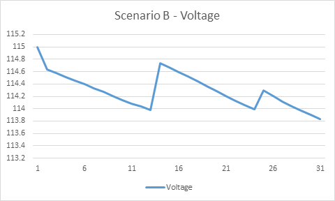
> Figure 6 (a) Scenario B: One Transformer’s Tap Changer Reaches the Limit

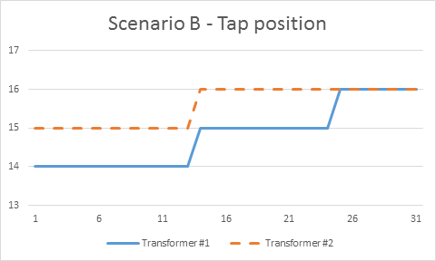
Figure 6 (b) Scenario B: One Transformer’s Tap Changer Reaches the Limit

*Test 2: Capacitor Bank Switching*
----------------------------------

In this section, the simulation is conducted to demonstrate the control mechanism for two capacitor banks. While the load is being increased by 3% in each step, the control decisions of these two capacitor banks are achieved when the voltages at their related buses reach the lower limit, which is 113.5kV.

*Scenario C: Capacitor Bank Switch On when Load Increase*
---------------------------------------------------------

1.  Run **DVPScaleLoad\_CreateBenchMarkModel.py**

> The script will switch off both capbanks at buses 314521 and 314519.

2.  Initialize the capacitor bank breaker configuration (**CapBkrV**) for both capacitor banks as “TRIP” in **CapBank1.csv** and **CapBank2.csv** files.

    Both capacitor banks are currently on standby status. As load increasing continuously, the voltage controller is capable to regulate to a preferable voltage magnitude with operations of capacitor banks’ breakers to put capacitor banks online.

3.  Navigate to the directory of C\# scripts of Voltage Controller, run the solution file **VoltController4.sln** under the Microsoft Visual Studio environment. It generates a series of operation condition frames according to different load settings during the voltage control stage.

**Comment:** From the results in **CapBank1.csv** and **CapBank2.csv**, plot the voltage magnitudes values for the capacitor banks, as shown in Fig.5(a). In Fig.5(b), “1” indicates the capacitor bank’s breaker is closed, and “0” indicates otherwise. As the load demand kept rising, the figure has shown that at the time instance 2, due to the high-load setting, the voltage at the controlled bus of the capacitor bank 1 has significantly dropped to 111.11kV, then the voltage controller decided to close one of the capacitor bank breaker and raised up the voltage at the time instance 3. Such process occurred again at the time instance 29, the voltage controller closed the capacitor bank 2’s breaker, after the voltage at the controlled bus of capacitor bank 2 dropped to 113.49kV (&lt; 113.5kV). In addition, at the time instance 6, because the tap-changing operation occurred after a certain amount of time delay, the voltages are dropped subtly at both controlled buses.

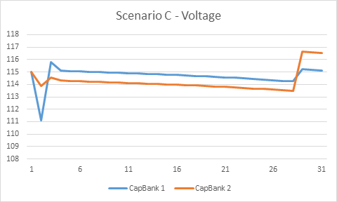
> Figure 7 (a) Scenario C-Voltage

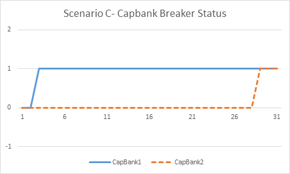
Figure 7 (b) Scenario C- Capbank Breaker Status

*Scenario D: Capacitor Bank Switch Off when Load Decrease*
----------------------------------------------------------

1.  Run **DVPScaleLoad\_CreateBenchMarkModel.py**

    The script will scale down the load at buses: 314691, 314692, 314693, 314694, 314695 for 10%, such that create a benchmark model with voltage at bus 314519 higher than 117 kV. Both capbanks’ breakers are set as closed.

2.  Initialize the tap changers configurations for both transformers as 0, the original tap position for LTC in **transformer1.csv** and **transformer2.csv** files,

    Both transformers are unable to reach the highest tap position setting, which is 16. Besides, initialize the capacitor bank breaker configuration (CapBkrV) for both capacitor banks as “CLOSE” in **CapBank1.csv** and **CapBank2.csv** files. As load decreasing continuously, the Voltage Controller is capable to regulate to a preferable voltage magnitude with the comprehensive operations of transformers’ tap changing and closing/tripping capacitor banks.

3.  Navigate to the directory of C\# scripts of Voltage Controller, run the solution file **VoltController4.sln** under the Microsoft Visual Studio environment. It generates a series of operation condition frames according to different load settings during the voltage control stage.

**Comment:** From the results in **transformer1.csv**, plot the voltage magnitudes and the values for tap changer for this transformer. Fig.5 indicates the changes of voltage magnitude, the tap positions, and the status of capacitor banks’ breakers. At the beginning, a significant load drop occurred at the time instance 2, which led to a considerable voltage increased to 117.4kV, then intermediately triggered the operation of tripping one capacitor bank according to the voltage controller mechanism. As the load demand kept dropping, the figure has shown a touch of the upper limit 116.1kV at the time instance 5, which has triggered tap changing to a lower position in both transformers.

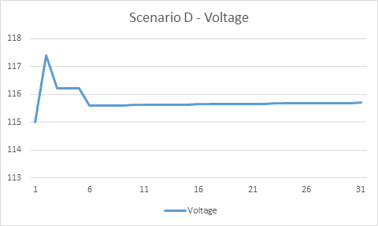
>Figure 8 (a) Scenario D - Voltage

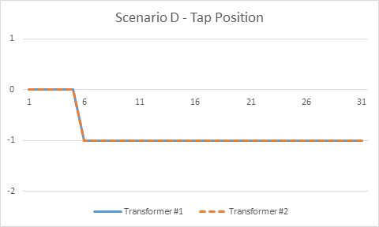
>Figure 8 (b) Scenario D – Tap position

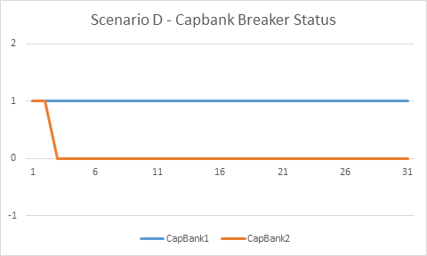
>Figure 9 (c) Scenario D – Capbank Breaker Status
