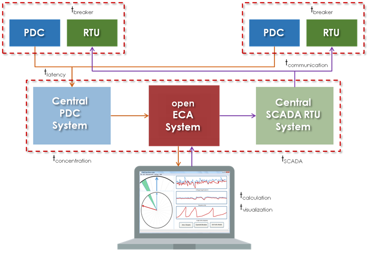
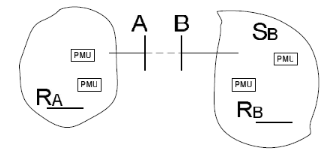
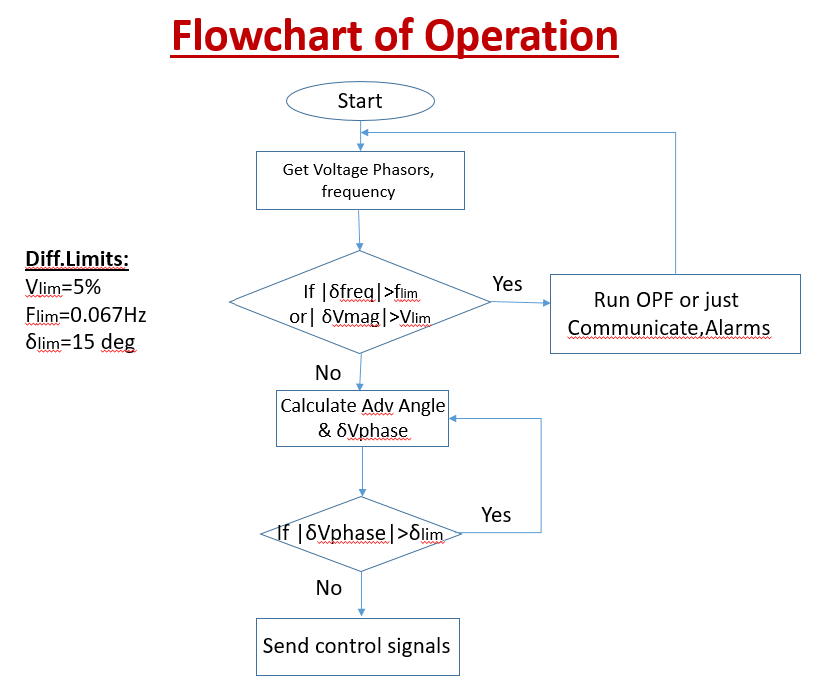
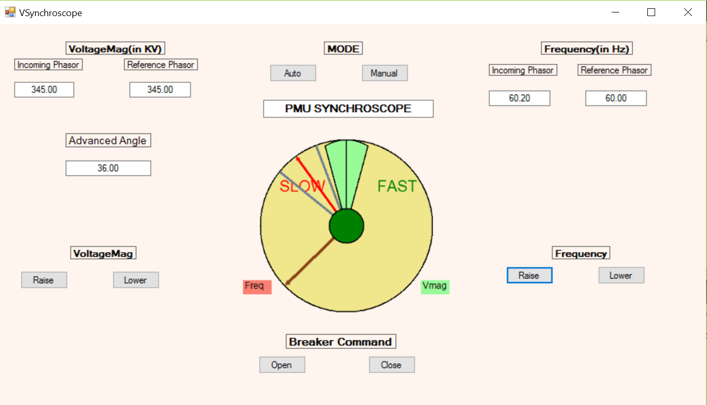
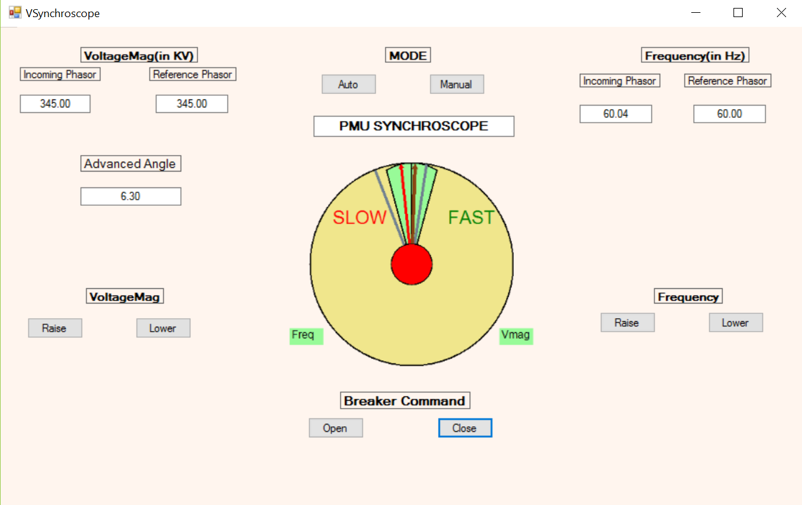

# PMU Synchroscope
### openECA Analytic Design Document

|     |
| --- |
| **Tapas Kumar Barik** |
| **2016-11-10** |

**Statement of Work**
=====================

The Goal is to develop a generalized tool to provide synchroscope functionality to a remote location overcoming communication (and other) delays by estimating end-to-end delays and predicting closing time through:

*  Manual (computer supervised) controlled close

*  Automatic (computer actuated) controlled close

*  Block control when parameters are out of bounds

In other words, the analytic should be able to connect to a stream of synchrophasor data from the open ECA platform and send control signals back to the open ECA from a remote location as shown in the figure below:

For the Alpha version of the Analytic, mockup application showing measurements and controls has been designed. A constant delay (in milliseconds) is introduced. In the future, estimation of this delay along with its distribution will be included along with actual data measurements from a simple predefined model.

**Introduction to The Topology Estimator**
==========================================

A synchroscope is a physical device that assists with the synchronization of generators or islands with the grid. These devices are typically physically located where the synchronization takes place. High accuracy, time synchronized phasor measurements enable synchroscope functionality through a centralized control platform. The Synchroscope must be able to estimate all major contributing end-to-end delays and provide statistical variances for each type of delay including but not limited to Measurement delivery delay (t, σlatency),Central concentration delay (t, σconcentration),Visualization delay (t, σvisualization),Calculation delay (t, σcalculation),Human actuation delay (t, σhuman),SCADA delay (t, σSCADA),Communication delay (t, σcommunication),Breaker closing time delay (t, σbreaker).

**Synchronizing method:**

To synchronize two separate islands, we need to retrieve voltage phasor measurements and frequency at Bus A and B. Cumulative Delays are calculated depending upon network configuration and traffic of the path adopted. (To be tested first with constant delays). Following the procedure as stated before, we calculate Advanced Angle of operations considering delays and difference in Voltage angles. Depending upon power flow requirements extra constraint can be added to the algorithm for **f**incoming>**f**Reference. Also δlim window for angle would also be modified based upon the Adv. Angle.

Adv.Ang = {(Slip)cyc/sec}{sec/60 cyc}{360/cyc}{(Cumulative Delay)cyc}

Figure: Two islands to be synchronized by closing breaker between Bus A and Bus B

**Initial Mockup:**

A simple Rotating Synchroscope Mockup Application (without any stream of Data) is built. Run the VSynchroscope.cs file to open the application and its associated code. Once the application is run the following window pops up as shown below. Selection between Auto and Manual Mode is provided left to the discretion of the user. Manual Mode of Operation is only shown as of now. Voltage and Frequency measurements are displayed at the top for both the Reference phasor and the incoming phasor. The breaker command controls would be at the bottom of the mockup. Voltage magnitude and Frequency can be regulated as seen from the output of the program. The size of the Voltage phasor would change depending upon the predetermined increment. In this version, one click is set to change 0.05/3 pu (i.e. 3 clicks changes 0.05 pu of V\_mag). Also frequency can be regulated depending upon which the voltage phasor may either rotate slowly or even in the opposite direction depending upon whether it is greater than or lesser than the Reference frequency (One click changes 0.033 Hz of slip). Depending upon whether Voltage magnitude and frequency difference tolerance limits are satisfied, indications are displayed. (Green-Satisfied, Red-Not satisfied).

A constant delay (of 500 milliseconds) has been incorporated in our mockup. Depending upon the slip frequency and this delay and using the equation as shown earlier, the Advanced Angle is calculated and displayed and thus the modified tolerance window is formed. Any breaker close command within this window will result in the closing of the synchronizing breaker within the actual tolerance window subjected to the fact that all other requirements were met during breaker close command initiation i.e. breaker close Command can only be initiated when **all** the criteria are met.

Indication for Successful Synchronization would be reflected in the center (Color Change from Green to Red)

In the Alpha Version of the analytic, the functionality of such a remote synchroscope is depicted. Ideally the incoming phasor is supposed to run at a greater frequency than the Reference phasor so that power would flow from island of incoming phasor to island of Reference phasor. But in our analytic it can be done either ways (forward/reverse synchronization). Depending upon requirements, reverse synchronization (counter-clockwise rotation mode) may be switched off.
