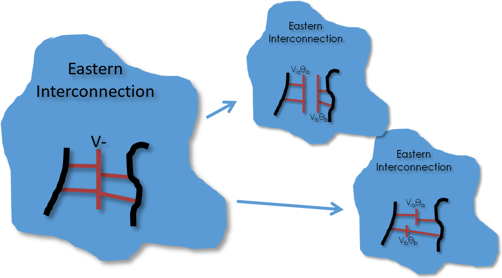
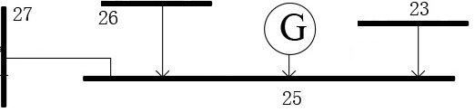
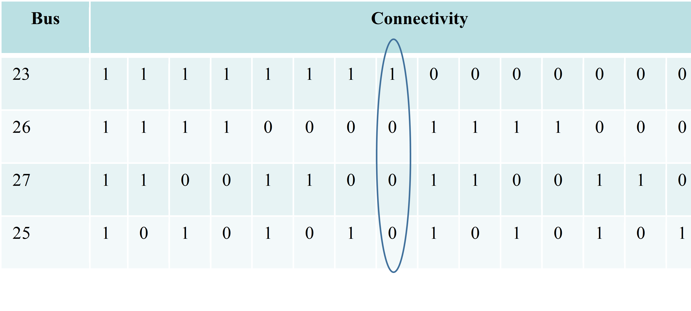
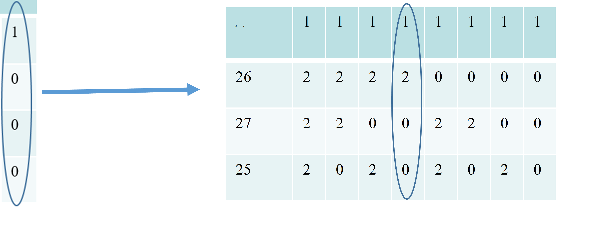
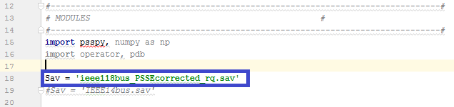
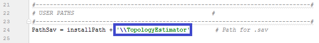
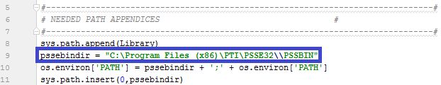
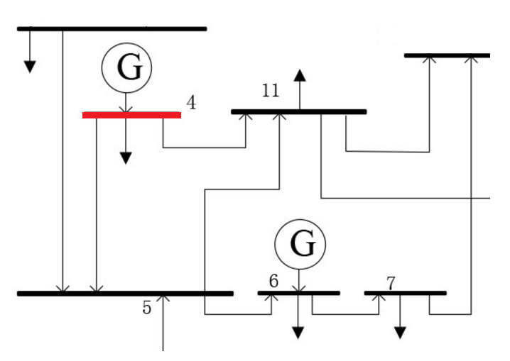
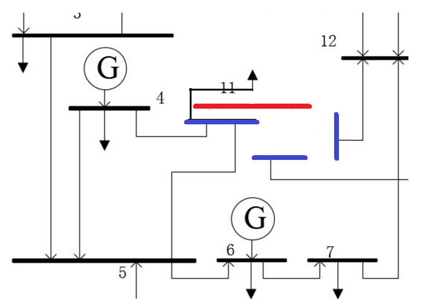
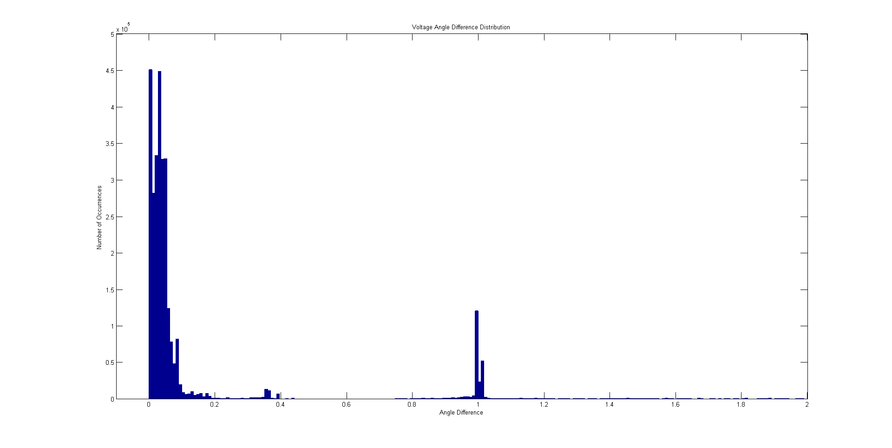

# Topology Estimator
### OpenECA Analytic Design Document

|                                  |
| -------------------------------- |
| **Tapas Kumar Barik**            |
| **Andreas Schmitt**              |
| **2016-11-10**                   |

**1. Statement of Work**
=====================

The purpose of the Topology Estimator Analytic is to provide increased awareness of the real –time network topology to the Linear State Estimator and other network applications. Using measurements of voltage phasors, current phasors, and circuit breaker statuses from across the transmission network, the topology estimator should improve knowledge of current topology by:

*  Observing unmeasured breaker statuses

*  Validating measured breaker statuses

*  Identifying topological errors

*  Inferring state of unmetered equipment

*  Reducing impact of topological discrepancies on the LSE

In summary, this method provides a phasor measurement based assessment of network topology. On the basis of Voltage phasor data from various PMUs across the network a particular Delta threshold within Voltage angle and Voltage magnitudes is calculated which will be served as a criterion to reconstruct the bus branch model of the system in the online module which would be integrated to the Linear State Estimator in the future. For the Alpha version of the Analytic, the offline module for calculation of this Delta threshold is shown.

**2. Introduction to The Topology Estimator**
==========================================

To estimate the topology of the system we rely upon the concept of equi-potentiality to determine Voltage Coherency among buses. Two voltage phasors that have been deemed valid and are of sufficient quality can be considered *‘coherent’* if they are empirically determined to be equi-potential. Coherency can be determined by checking if error (usually the phase angle which is a better indicator) between *V1* and *V2* is less than a pre-determined threshold(*δthreshold*).

To calculate this *δthreshold* we carry out a series of off-line power analyses on various configurations associated with a particular bus(substation). For the Alpha version we have carried out the analysis on a standard IEEE 118 bus system. To achieve this:

1.  We procedurally split each bus into each of its possible configurations one at a time (one change per flow) as shown in the figure.

Figure: Splitting the system into various configurations

2. For each power flow we observe the change in complex voltage at the bus of interest for pre and post load flow conditions.

3. Analysis of these Delta voltage angles and Delta voltage magnitudes between disconnected elements and concerned buses would yield our desired *δthreshold* Of course all the cases won’t satisfy these and thus we have considered the calculation based on 95% success rate of all cases.

Each Bus in the System Model is characterized as a substation and needs to be re-configured into various configurations depending upon possible outages of circuits connected to it. So, the first objective is to know the number of circuits/elements connected to the particular substation. Let us consider Bus number 25 of the IEEE 118 bus system.

> Figure: Bus number-25 in the standard IEEE bus system.

As we can see there are four elements/circuits attached to Bus number-25(three lines/branches and one generator). The possible configurations would take the following form:

Where:1-Connected ,0-Disconnected w.r.t Bus 25

Bus 25(the current bus number itself) in the table refers to the connectivity of the equipment(generator) at that particular substation. But the problem arises as the number of configurations for carrying out our analysis are not only limited to these 2^total number of circuits (16 in this case). But for the generic analysis we are considering the substation topology as a Black Box and thus disconnected circuits can be either completely separated from each other or may be grouped within themselves in any fashion whatsoever

This leads to much more modifications within the initial configuration column itself. And thus the dimensionality of the problem increases .

In the Alpha Version of the analytic, for a generic and comprehensive study, we have taken into consideration a maximum of 6 disconnections at a particular substations and finding out all the possible configurations in this regards. Finally plots are presented depicting the distribution of all the Delta points at the end.

**3. Program Details and User Manual**
======================================

3.1 *Initialization and Running*
---

***Note***: This program is written in Python 2.5 and compatible with PSS/E version 32

There are several actions that need to be taken before running the program to insure that the program is configured properly.

1.  Ensure that the PSS/E .sav file is within the same folder as the python code files

2.  Rename ‘.sav’ file within the main function to the name of the file you wish to use

3.  Change the path name within the name function to the name of the folder containing the python files

4.  If PSS/E is installed in a location other than C:\\Program Files (x86), modify the variable: pssebindir to direct the program to the correct location(the \\PTI\\PSSE32\\\\PSSBIN)

Once the program has been configured to your system, it can be run.

***Note***: Depending on the UI used for running python code, after the program has started running it may ask for a command simply saying “Yes?”. If this is the case, simply enter a blank command.

The program outputs the list of voltage angle and magnitude lists to a .csv file named “mycsv.csv”. From this data, the delta and magnitude threshold can be determined and the percentage error can be seen. An example can be seen in the section 4 for the IEEE 118 bus system model.

The following sections detail the algorithm behind each function for the program.

3.2 *Main Function*
---------------

The main function inside which we first start the analysis of delta threshold from a particular bus number to the desired bus number. At each bus number we find the number of circuits/elements connected by calling the bus\_connections function and then calculate all the possible configurations of disconnection combinations possible by calling the configuration\_matrix function. Then for each element in the configuration\_matrix list (i.e. each possible combination) we calculate the outage buses and their groupings which is the outage\_matrix list and then we update the network by rearranging the loads/Generators/Lines/2 winding Transformers as required, creating an additional fake bus as required. This is achieved by calling the update\_network function. Finally load flow is rum for each case and Difference in angles and V\_mag is calculated between the current bus number and the disconnected fake bus, thus leading to the study of a suitable Delta threshold which can guarantee minimum number of failed cases based on this methodology.

3.3 *Bus\_Connections*
------------------

The purpose of this function is to calculate the number of objects connected to a specific input bus and to determine each of those objects. The output will give you a number of connections and a list contained each bus connected. Additionally, if the bus has a generator and additional connection of its own bus number is added. If there is a load present at the bus, an additional connection with the value of 100000000 is added.

For example, when looking at the following bus number 4.

It can be seen that, bus 4 is connect to two other buses, one generator and one load. Therefore, there are 4 connections for this bus and the list would be \[5,11,4,10000000\].

3.4 *Update\_Network*
-----------------

This function modifies the current system depending on the current outage scenario given to the function. Outage\_matrix provides the current connection list of the buses surrounding the current bus to the current bus and between each other. The network is updates so that each bus within the same outage group is connected to each other through a newly created bus. Any bus in outage group 0 is connected to a newly created bus individually. Branches connecting the current bus and the buses connected to this bus that are in the outage group are taken out of service and new branches are created connecting the outside buses and the newly created buses.

For example, when looking at Bus 11 in the previous figure, if buses 4, 5, and the load are in group two and all other buses are in group 0 the new system created will appear like this:

Any buses connected to the current bus which are not in the outage matrix remain connected to the current bus.

3.5 *Truthtable*
------------

The purpose of this function is to create a truth\_table consisting of 0’s and 1’s which will be used in the configuration function later. This provides the possible number of configurations based on the variable n in a list format consisting of 2^n elements inside the final temp list.

3.6 *Configuration*
---------------

The purpose of this function is to create all possible configurations of the disconnected elements or circuits (branch, Gen, loads) which were initially attached to our current substation. Now the original configuration list would have been simply the list as provided by the truth\_table function. But as the disconnected (from the substation) circuits or elements can be regrouped among each other we have to cater all the possibilities for our study and thus come up with a generic yet comprehensive Delta threshold. This function is to generate all those possible configurations (much greater than simply 2^contingency).

**4. Demonstration**
=================

All the possible configurations(with a maximum disconnection of 6 elements at a particular bus) were analyzed and the following distribution of Voltage Angle difference distribution is plotted but based upon a success rate of near about 96% of all cases, Delta angle threshold was calculated to be **0.75 degrees (with max V\_mag difference of 0.02 pu).**

