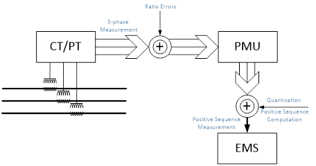
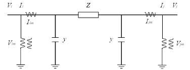
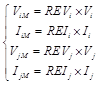
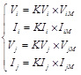
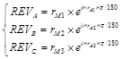
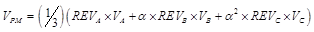
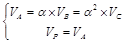
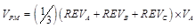
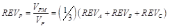
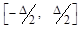

# Transmission Line Impedance Calibration
## OpenECA Analytic Design Document

| |
| --- |
| **Chen Wang** |
| **11/10/2016** |

**Statement of Work**
=====================

The analytic of transmission line impedance calibration is aiming to use linear Least Squares Estimation method to estimate the true line impedance of the whole power system given measurement error of the transducers. The alpha version of the program of this analytic firstly takes PSS\\E simulated PMU measurements as input; then, analyzes the topology of the aimed power network; thirdly starting from one of the buses taken as the calibration starting bus that equipped with revenue PT and the corresponding line that equipped with revenue CT, conducts single transmission line impedance calibration; finally propagate the accuracy to the whole system based on its tree topology. The alpha version program is designed to be operating without openECA platform.

**Introduction**
================

One of the ways to get the knowledge of the transmission lines’ impedances is to use the voltage and current measurements one get from the PMUs to conduct the Ohm Law. But as is shown in the previous analytic of CT/PT Calibration, such measurement would have ratio errors from the instrument transformers (CT/PTs) and the errors added by PMUs brought by the digitalization process. Both the errors brought by CT/PTs and PMUs is going to influence the accuracy of the calculation of the line. Therefore, one need to first know the components of the errors, then utilize estimation methods to find out the exact error to find the true impedances within the system.

**Transmission Line Impedance Calibration Methodology**
=======================================================

1.  *Measurement Data Flow*
        -----------------------

The actual voltages and currents of each single transmission line will firstly detected by the CT/PTs, and those values should be complex numbers and three-phase separately. Such transducers will inevitably add ratio errors which are also three-phases to those true values and send them to the PMUs. PMUs then are going to quantize each phase’s data and provide the positive sequence measurements to the energy management system after computation. The whole process is shown in Figure III‑1

  
> Figure III‑1. Voltage and Current Measurement Data Flow

The ratio errors, both three-phase separately and positive sequence, aforementioned are also complex values. For each single transmission line, the relationship among true values, measurements, and ratio errors is shown as in Figure III-2 and equation (3.1).

  
> Figure III‑2. CT/PT Measurements Demonstration

 (3.1)

where, ViM and Vi are the measurement of and true voltage on bus *i*, respectively; IiM and Ii are the measurement of and true current flowing from bus *i* to bus *j*, respectively; REVi and REIi are the ratio errors of voltage and currents on or flowing out of bus *i*, respectively. The values on bus *j* are similar. All the values aforementioned are of positive sequence.

Accordingly, one can find the ratio correction factors KVi, KIi, KVj, and KIj as follow

 (3.2)

Such factors are equivalent to the ratio errors and will be used in the following calibration methodology.

However, for various phases, the ratio errors should be different. According to the IEEE C57.13-2016 standard, the ratio errors are as follows:

 (3.3)

where REVA is the ratio error of phase A voltage measurement; rM1 is the error magnitude, which should be within [0.9,1.1]; rA1 is the error angle, which should be within [-10°, 10°]. The ratio errors of the other two phases are respectively similar.

The CT/PTs will integrate ratio errors to the three-phase measurements separately. But the PMUs will provide positive sequence values. Therefore, taking voltage as example, the positive sequence voltage measurements would be as follow

 (3.4)

where, VPM is the measured positive sequence voltage value; VA, VB,  and VC are the true values of three-phase voltages respectively; α is e2πi/3.

If the three-phase voltage measurements are balanced, namely

 (3.5)

then,

 (3.6)

Therefore, the positive sequence ratio error is

 (3.7)

For the field data, the differences between three-phase measurements are less than 1%. Thus, as the three phases’ ratio errors keep constant, there is a constant positive sequence ratio error for each PMU measurements.

*PMU Quantization and Error*
----------------------------

The PMUs installed on each 500KV buses within the system would provide time-stamped voltage and current measurements. According to the IEEE Std. C37.118, the digital signals output by PMUs are firstly quantized and then transferred to the positive sequence values. The quantization scale of the three-phase voltage measurements is 20V and that of the three-phase current measurements is 0.65A. Such results are based on the real PMU data

Some conclusions could be reached. Firstly, both the real and imaginary parts of the three single phases’ measurements are perfectly and separately quantized by the PMU because of its own characteristics.

Then the positive sequence measurements are thus approximately quantized. Take Δ as the quantization scale. The quantization error of the positive sequence values, i.e. x - quant(x,Δ), is uniformly distributed within  according to Theorem III 1.

**Theorem III‑1**. If x is uniformly distributed in [-m, n ] then x - quant(x,Δ) is uniformly distributed in  for any n and m.

Since the PMU quantization error is also uniformly distributed within a known range, the expectation of such error is 0 and therefore unbiased. During the estimation process, such 3-phase to positive sequence transfer error could be eliminated by conducting multiple times calibration and averaging the estimation results.

*Single Transmission Line Impedance Calibration Methodology*
------------------------------------------------------------

The single transmission line impedance calibration method is similar to the instrument transformer calibration method. We are also going to use the measured voltages and currents from both sides of the line to conduct the LSE algorithm. The estimation result is going to be the estimated impedance matrix **LEFT OFF HERE**.

However, the impedance and susceptance here is unknown and to be calculated. To simplify the calculation, two new variables are introduced as shown in equation .

With the entries of , we can calculate the estimated impedance and susceptance by compute estimated firstly.

If we know the correction factors of the voltage and current measurements of the bus , the correction factors on bus can then be calibrated as follow.

Then the estimated susceptance can be calculated as follow.

The single transmission line impedance can be calibrated as follow.

*System Propagation Methodology*
--------------------------------

The single line impedance calibration method can not only estimate the impedance and susceptance of the concerned transmission line, but also calibrate the correction factors of the instrument transformers on the other side of the line. However, this is based on the fact that both the and are known.

Since the voltage on one bus will always remain the same no matter measured from which line that connects to it, the bus voltage correction factor is chosen as the propagation media. Based on the aforementioned fact, we can find that if there are lines that connected to the concerned bus as in Figure III-3, the voltages measured by different PTs on those lines should be as follow.

Figure III‑3. Bus Voltage Injections

where, is the true value of the voltage on bus ; is the voltage correction factor of the PT measuring the voltage of bus on line ; is the voltage measurement of bus on line and .

Therefore, if we know one of the correction factors from the calibration of the previous line, we will be able to reach the true value of the voltage on the concerned bus. Thus we can calculate all the other ones and acquire enough information to calibrate the following lines.

In order to calculate all the ’s of current injections on the bus , we firstly need to know all the current injection measurements. A typical bus injection that has lines connected to it can be shown as Figure III‑4.

Figure III‑4 Bus Current Injections Demonstration

If one of the correction factors, for example , is known, this equation can be written as

With the LSE method and the current injections measurements, the correction factors of all the other lines connected to the concerned bus can be estimated.

With such propagation method, if we can form the whole system into a tree topology, then all the CTs and PTs within such tree can be calibrated, given that the impedance as well as the susceptances are known and the existence of a redundant PT. The graphical searching method could be Breadth First Search(BFS) which is shown in Figure III-5. The numbers are the order based on which the nodes are visited.

Figure III‑5. Breadth First Search Method

1.  **Program Architecture (Alpha Version)**
    ==============================================================================================================================

    1.  *Data Structure*
        ----------------

The data structure of the alpha version controller is shown as follows:

*Data Flow*
-----------

1.  **Program Details (Alpha Version)**
    ===================================

    1.  *Program Process*
        -----------------

<!-- -->

1.  PSS\\E power system operation simulation

> Use PSS\\E to conduct power flow based on the IEEE 118-bus power system and the morning load pick-up curve to generate the voltages of the 345KV buses and currents flowing though corresponding transmission lines.

1.  Raw data processing

    Read in CSV file generated by Python and PSS\\E.

2.  Building error model (For test plan)

> Add CT/PT measurement errors and PMU errors to the raw data of voltages and currents based on the derived error model; record the positive sequence errors and the true line impedance and susceptance.

1.  System topology analysis

    Analyze the system topology based on the from-bus and to-bus information of the concerned lines; find the order of calibration propagation.

2.  Transmission line impedance calibration

    Conduct the transmission line impedance calibration starting from the 345KV bus and corresponding line that equipped with revenue transducers; use the injection propagation method aforementioned to calibrate the whole 345KV system.

<!-- -->

1.  **Demonstration**
    =================

    1.  *Raw Data Generation*
        ---------------------

In this section, the PSS\\E simulation is conducted to generate voltage and current data of the concerned power system. The PSS\\E is accessed through Python.

1.  Locate in to the folder maned as ***Step\_1\_VI\_Acquisition***; run the file ***IEEE\_118\_data\_generation\_main.py*** to start generating voltage and current measurements data.

<!-- -->

1.  The generated voltage and current data can be found in the file named as ***VI\_Measurement\_All\_345KV\_Buses\_Peak\_PQI.csv***; copy this file and paste it into the ***Step\_2\_Error Model*** folder.

    1.  *Error Model Construction *
        ---------------------------

In this section, the CT/PT and PMU errors are added into the simulated data to construct the error model.

1.  Locate in to the folder maned as ***Step\_2\_Error Model.*** Run ***Matlab\_CSV\_adapter\_IEEE\_118.m*** through Matlab to acquire the bus information, voltage and current simulated data from the CSV file, ***VI\_Measurement\_All\_345KV\_Buses\_Peak.csv***; the results include

    1) the 345KV bus number set, saved in ***Bus\_number\_set\_345KV.mat***,

    2) the true values of the positive sequence voltages on each 345 KV buses, saved in ***V\_true\_value\_positive\_sequence.mat***,

    3) the true positive sequence currents flowing through all the lines, two-winding transformers, and three-winding transformers connected to the 345KV buses, saved in ***I\_true\_value\_positive\_sequence.mat***, ***I\_true\_value\_positive\_sequence\_trn.mat***, and ***I\_true\_value\_positive\_sequence\_gen.mat*** respectively,

    4) the from-bus numbers and to-bus numbers of each transmission line, two-winding transformers, and three-winding transformers connected to the 345KV buses, saved in ***line\_bus\_info\_all\_lines.mat***, ***line\_bus\_info\_trn.mat***, ***line\_bus\_info\_gen.mat***.

<!-- -->

1.  Run ***Line\_data\_generation\_IEEE\_118.m*** through Matlab to acquire the power system network information, save the true value of the voltages and currents of each line or transformer equivalent line, and construct the error model introduced previously; the network information is saved in ***AC\_line\_info.mat*** which is formed as 11 column vectors, i.e. **\[line number, line ID, line type, from bus number, KV1, KI1, to bus number, KV2, KI2, Z, y\]**, as well as the bus number information of all the 345KV transmission lines, saved in ***line\_bus\_info\_345KV.mat***; each transmission line or transformer equivalent line is assigned a line number, and the three-phase true value of the voltages and currents of each line is saved in the files named as ***line\_(line number)\_true\_3\_phase.mat***; the true positive sequence values are saved in the files named as ***line\_(line number)\_true\_positive\_sequence.mat*** in the format of **\[from-bus voltages, from-bus currents, to-bus voltages, to-bus currents\]**; the positive sequence values added errors are referred to as measured value and are saved in the files named as ***line\_(line number)\_measured\_positive\_sequence.mat*** with the same format as true value files; the total line number is 129 in the test case.

2.  Run ***True\_impedance\_calculation\_IEEE\_118.m*** through Matlab to acquire 345KV transmission lines’ impedances and susceptances and assign such data to the 10th and 11th column of ***AC\_line\_info.mat*** respectively and save the **AC\_line\_info** matrix in the file ***AC\_line\_info\_true\_value\_Zy.mat***.

3.  Copy the following files and paste it into the ***Step\_3\_Impedance Calibration*** folder: ***AC\_line\_info\_true\_value\_Zy.mat***,

    ***Bus\_number\_set\_345KV.mat***,

    ***line\_(every linenumber)\_measured\_positive\_sequence.mat,***

    ***line\_(every line number)\_true\_positive\_sequence.mat,***

    ***line\_(every line number)\_true\_3\_phase.mat (optional),***

    ***line\_bus\_info\_345KV.mat***.

    1.  *Transmission Line Impedance Calibration*
        -----------------------------------------

In this section, the transmission line impedance calibration is conducted based on the simulated data throughout the 345KV subsystem within the IEEE 118 system.

1.  Locate in to the folder maned as ***Step\_3\_Impedance Calibration*.** Run ***line\_parameter\_estimation\_IEEE\_118.m*** through Matlab to start the impedance calibration process; notice that only run the following part of the code at the first time of the tests based on the same accurate bus to save the original voltage and current data of that bus and corresponding line.

    %----------------------------------------------------%

    line\_name=\['line\_',num2str(original\_accurate\_line\_number), '\_measured\_positive\_sequence.mat'\];

    VI\_origin\_struct=load(line\_name);

    VI\_measurement\_set = VI\_origin\_struct.VI\_measurement\_set;

    line\_name=\['line\_',num2str(original\_accurate\_line\_number),'\_measured\_positive\_sequence\_origin.mat'\];

    save(line\_name,'VI\_measurement\_set');

    %----------------------------------------------------%

2.  The Results are saved in the file named as ***line\_estimation\_results.mat*** in the form of ***\[line number, from bus number, KV1\_hat, KI1\_hat, to bus number, KV2\_hat, KI2\_hat, Z\_hat, y\_hat\],*** and the errors of the calibration are shown in the command window of Matlab as follow:

| line\_number           | KV1\_error                               | KI1\_error                             | KV2\_error                               | KI2\_error                             | Z\_pu\_error                             |
|------------------------|------------------------------------------|----------------------------------------|------------------------------------------|----------------------------------------|------------------------------------------|
| \_\_\_\_\_\_\_\_\_\_\_ | \_\_\_\_\_\_\_\_\_\_\_\_\_\_\_\_\_\_\_\_ | \_\_\_\_\_\_\_\_\_\_\_\_\_\_\_\_\_\_\_ | \_\_\_\_\_\_\_\_\_\_\_\_\_\_\_\_\_\_\_\_ | \_\_\_\_\_\_\_\_\_\_\_\_\_\_\_\_\_\_\_ | \_\_\_\_\_\_\_\_\_\_\_\_\_\_\_\_\_\_\_\_ |
| 10                     | 0+0i                                     | 0+0i                                   | -8.9665e-08+6.4759e-08i                  | 3.3729e-05+0.00031885i                 | -3.875e-06-2.2941e-06i                   |
| 9                      | -9.354e-07-8.6411e-08i                   | -0.054176-0.00059463i                  | -2.5268e-07+5.4999e-07i                  | -0.053696-0.0020156i                   | 5.0668e-05+0.00091915i                   |
| 6                      | -1.4385e-06+5.4042e-07i                  | -0.048562-0.003765i                    | -0.00011939+3.0773e-05i                  | -0.048432-0.0062498i                   | -9.3247e-05+0.0049665i                   |
| 8                      | -1.0321e-06+4.2567e-07i                  | -0.039879-0.090114i                    | 2.2211e-05-7.1517e-06i                   | -0.041844-0.090051i                    | -0.0028379+0.0012278i                    |
| 5                      | -0.0001226+2.5583e-05i                   | 0.022484+0.054404i                     | -0.00010721+3.6383e-05i                  | 0.023412+0.054581i                     | -0.0029328-0.0010324i                    |
| 7                      | 2.1753e-05-6.4653e-06i                   | -0.041025-0.085287i                    | -1.9731e-05-1.0317e-05i                  | -0.039203-0.10122i                     | -0.0019038+0.0008451i                    |
| 2                      | -0.00010823+2.8655e-05i                  | 0.022379+0.085188i                     | -0.00012491+4.5585e-05i                  | 0.023679+0.087327i                     | -0.0042015-0.0010638i                    |
| 4                      | -0.0001055+3.0809e-05i                   | -0.0077874+0.011213i                   | -0.00010639+5.3453e-05i                  | -0.0077156+0.011843i                   | -0.0009939+0.0007427i                    |
| 1                      | -0.00012286+5.0807e-05i                  | -0.023302-0.021114i                    | -0.00011483+4.8006e-05i                  | -0.022492-0.021357i                    | -0.00057764+0.00075118i                  |
| 3                      | -0.00011492+5.251e-05i                   | -0.021822-0.021623i                    | -0.0001167+6.4248e-05i                   | -0.022818-0.019937i                    | -0.00061303+0.00080305i                  |

Note: For some of the lines in IEEE 118 bus system, there are generators that connect to the relevant buses directly, which is not feasible in real-world power system. There is a good reason to believe that such scenario that generator -&gt; line -&gt; bus -&gt; line -&gt; bus connection should has negative influence to the estimation accuracy. Besides, given the propagation process, the estimation error of the previous pi-section will surely affect the consecutive ones, i.e. accumulation effect of the errors. Therefore, the later the lines are visited, the larger the estimation errors will be. For the further versions of the application, the algorithms will be improved to provide more accurate results.
